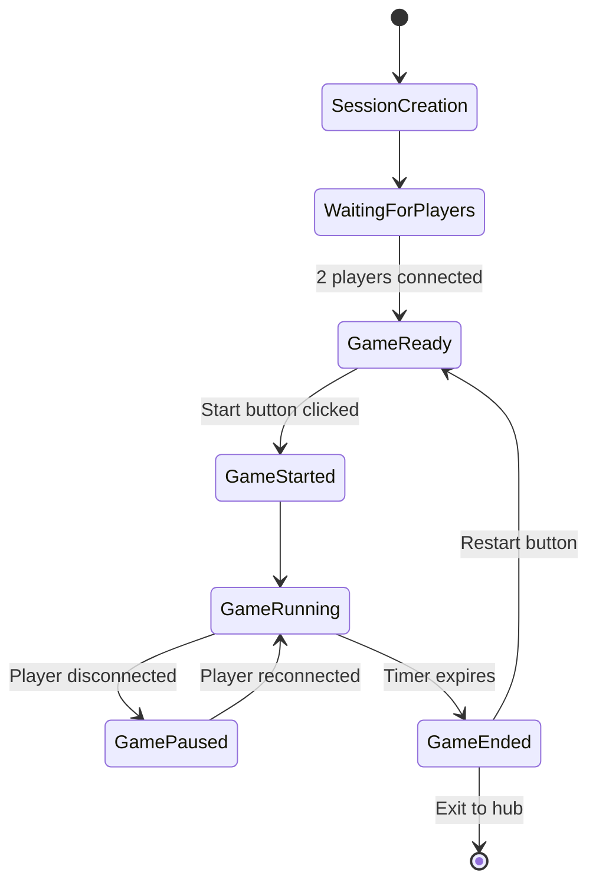

# Design Document

## Overview

도토리 배틀(Acorn Battle)은 Sensor Game Hub v6.0 플랫폼에서 구현되는 2인용 실시간 경쟁 게임입니다. 플레이어들은 모바일 기기의 센서(orientation.beta, gamma)를 사용하여 캐릭터를 조작하고, 맵에 흩어진 도토리를 수집하여 점수를 획득합니다. 게임의 핵심은 도토리 수집, 상대방 도토리 훔치기, 움직이는 장애물 회피라는 세 가지 메커니즘의 조화입니다.

## Architecture

### System Architecture

```mermaid
graph TB
    A[Game Host Browser] --> B[SessionSDK]
    B --> C[Socket.IO Server]
    C --> D[Session Manager]
    
    E[Mobile Sensor 1] --> F[/sensor.html]
    G[Mobile Sensor 2] --> H[/sensor.html]
    
    F --> C
    H --> C
    
    C --> I[Game State Synchronization]
    I --> A
    
    J[Game Canvas] --> K[Rendering Engine]
    L[Physics Engine] --> K
    M[Collision Detection] --> L
```

### Game Flow Architecture



## Components and Interfaces

### 1. Core Game Engine

#### AcornBattleGame Class
```javascript
class AcornBattleGame {
    constructor() {
        // SessionSDK 초기화 (dual 타입)
        this.sdk = new SessionSDK({
            gameId: 'acorn-battle',
            gameType: 'dual',
            serverUrl: window.location.origin
        });
        
        // 게임 상태 관리
        this.gameState = {
            phase: 'waiting',      // waiting, ready, playing, paused, ended
            timeRemaining: 60,     // 1분 게임
            players: {
                sensor1: { score: 0, x: 0, y: 0, hasAcorn: false, stunned: false },
                sensor2: { score: 0, x: 0, y: 0, hasAcorn: false, stunned: false }
            },
            acorns: [],           // 맵의 도토리들
            obstacles: [],        // 움직이는 장애물들
            scoringZones: {       // 점수 구역들
                sensor1: { x: 0, y: 0, width: 100, height: 100 },
                sensor2: { x: 0, y: 0, width: 100, height: 100 }
            }
        };
    }
}
```

#### Game Loop Structure
```javascript
// 메인 게임 루프
gameLoop() {
    if (this.gameState.phase === 'playing') {
        this.update();
        this.render();
        this.checkCollisions();
        this.updateTimer();
    }
    requestAnimationFrame(() => this.gameLoop());
}

// 게임 상태 업데이트
update() {
    this.updatePlayers();
    this.updateObstacles();
    this.spawnAcorns();
    this.updateUI();
}
```

### 2. Player Management System

#### Player Entity
```javascript
class Player {
    constructor(sensorId, startX, startY, color) {
        this.sensorId = sensorId;
        this.position = { x: startX, y: startY };
        this.velocity = { x: 0, y: 0 };
        this.color = color;
        this.radius = 25;
        this.score = 0;
        this.hasAcorn = false;
        this.stunned = false;
        this.stunnedUntil = 0;
        this.invulnerable = false;
        this.invulnerableUntil = 0;
    }
    
    update(sensorData) {
        if (this.stunned && Date.now() < this.stunnedUntil) {
            return; // 기절 상태에서는 움직일 수 없음
        }
        
        if (this.stunned && Date.now() >= this.stunnedUntil) {
            this.stunned = false;
            this.invulnerable = true;
            this.invulnerableUntil = Date.now() + 1000; // 1초간 무적
        }
        
        // 센서 데이터로 이동
        const moveSpeed = 3;
        this.velocity.x = (sensorData.orientation.gamma || 0) * moveSpeed / 45;
        this.velocity.y = (sensorData.orientation.beta || 0) * moveSpeed / 45;
        
        this.position.x += this.velocity.x;
        this.position.y += this.velocity.y;
        
        // 맵 경계 체크
        this.constrainToMap();
    }
}
```

### 3. Acorn Management System

#### Acorn Entity
```javascript
class Acorn {
    constructor(x, y) {
        this.position = { x, y };
        this.radius = 15;
        this.collected = false;
        this.spawnTime = Date.now();
    }
    
    render(ctx) {
        ctx.fillStyle = '#8B4513';
        ctx.beginPath();
        ctx.arc(this.position.x, this.position.y, this.radius, 0, Math.PI * 2);
        ctx.fill();
        
        // 도토리 모양 디테일
        ctx.fillStyle = '#654321';
        ctx.fillRect(this.position.x - 3, this.position.y - this.radius - 5, 6, 8);
    }
}
```

#### Acorn Spawning System
```javascript
class AcornSpawner {
    constructor(gameInstance) {
        this.game = gameInstance;
        this.maxAcorns = 15;
        this.initialAcorns = 8;
        this.spawnInterval = 5000; // 5초마다
        this.lastSpawnTime = 0;
        this.totalSpawned = 0;
    }
    
    initialize() {
        // 초기 8개 도토리 생성
        for (let i = 0; i < this.initialAcorns; i++) {
            this.spawnAcorn();
        }
        this.totalSpawned = this.initialAcorns;
    }
    
    update() {
        const now = Date.now();
        if (now - this.lastSpawnTime >= this.spawnInterval && 
            this.totalSpawned < this.maxAcorns) {
            this.spawnAcorn();
            this.lastSpawnTime = now;
            this.totalSpawned++;
        }
    }
    
    spawnAcorn() {
        const position = this.getRandomSafePosition();
        const acorn = new Acorn(position.x, position.y);
        this.game.gameState.acorns.push(acorn);
    }
}
```

### 4. Obstacle System

#### Obstacle Entity
```javascript
class Obstacle {
    constructor(x, y, width, height, speedX, speedY) {
        this.position = { x, y };
        this.size = { width, height };
        this.velocity = { x: speedX, y: speedY };
        this.color = '#FF4444';
    }
    
    update(canvasWidth, canvasHeight) {
        this.position.x += this.velocity.x;
        this.position.y += this.velocity.y;
        
        // 벽에 부딪히면 방향 전환
        if (this.position.x <= 0 || this.position.x + this.size.width >= canvasWidth) {
            this.velocity.x *= -1;
        }
        if (this.position.y <= 0 || this.position.y + this.size.height >= canvasHeight) {
            this.velocity.y *= -1;
        }
    }
    
    render(ctx) {
        ctx.fillStyle = this.color;
        ctx.fillRect(this.position.x, this.position.y, this.size.width, this.size.height);
        
        // 위험 표시
        ctx.fillStyle = '#FFFF00';
        ctx.font = '20px Arial';
        ctx.textAlign = 'center';
        ctx.fillText('⚠️', 
            this.position.x + this.size.width / 2, 
            this.position.y + this.size.height / 2 + 7
        );
    }
}
```

### 5. Collision Detection System

#### Collision Manager
```javascript
class CollisionManager {
    constructor(gameInstance) {
        this.game = gameInstance;
    }
    
    checkAllCollisions() {
        this.checkPlayerAcornCollisions();
        this.checkPlayerObstacleCollisions();
        this.checkPlayerScoringZoneCollisions();
    }
    
    checkPlayerAcornCollisions() {
        Object.values(this.game.gameState.players).forEach(player => {
            if (player.hasAcorn) return; // 이미 도토리를 들고 있음
            
            this.game.gameState.acorns.forEach((acorn, index) => {
                if (this.isCircleCollision(player, acorn)) {
                    player.hasAcorn = true;
                    this.game.gameState.acorns.splice(index, 1);
                    this.game.playSound('pickup');
                }
            });
        });
    }
    
    checkPlayerObstacleCollisions() {
        Object.values(this.game.gameState.players).forEach(player => {
            if (player.invulnerable && Date.now() < player.invulnerableUntil) {
                return; // 무적 상태
            }
            
            this.game.gameState.obstacles.forEach(obstacle => {
                if (this.isPlayerObstacleCollision(player, obstacle)) {
                    this.handleObstacleCollision(player);
                }
            });
        });
    }
    
    handleObstacleCollision(player) {
        if (player.hasAcorn) {
            // 도토리 떨어뜨리기
            player.hasAcorn = false;
            this.game.acornSpawner.spawnAcorn(); // 새 위치에 도토리 생성
        }
        
        // 0.5초 기절
        player.stunned = true;
        player.stunnedUntil = Date.now() + 500;
        
        this.game.playSound('collision');
        this.game.showEffect('collision', player.position.x, player.position.y);
    }
}
```

### 6. Scoring System

#### Scoring Zone Manager
```javascript
class ScoringZoneManager {
    constructor(gameInstance) {
        this.game = gameInstance;
    }
    
    checkScoringZoneInteractions() {
        Object.entries(this.game.gameState.players).forEach(([sensorId, player]) => {
            // 자신의 점수 구역 체크
            const ownZone = this.game.gameState.scoringZones[sensorId];
            if (this.isPlayerInZone(player, ownZone)) {
                if (player.hasAcorn) {
                    this.scoreAcorn(player);
                }
            }
            
            // 상대방 점수 구역 체크 (도토리 훔치기)
            const opponentSensorId = sensorId === 'sensor1' ? 'sensor2' : 'sensor1';
            const opponentZone = this.game.gameState.scoringZones[opponentSensorId];
            const opponent = this.game.gameState.players[opponentSensorId];
            
            if (this.isPlayerInZone(player, opponentZone)) {
                if (!player.hasAcorn && opponent.score > 0) {
                    this.stealAcorn(player, opponent);
                }
            }
        });
    }
    
    scoreAcorn(player) {
        player.hasAcorn = false;
        player.score++;
        this.game.playSound('score');
        this.game.showEffect('score', player.position.x, player.position.y);
        this.game.updateScoreUI();
    }
    
    stealAcorn(thief, victim) {
        if (victim.score > 0) {
            victim.score--;
            thief.hasAcorn = true;
            this.game.playSound('steal');
            this.game.showEffect('steal', thief.position.x, thief.position.y);
            this.game.updateScoreUI();
        }
    }
}
```

## Data Models

### Game State Model
```javascript
const GameStateSchema = {
    phase: 'string',           // 'waiting' | 'ready' | 'playing' | 'paused' | 'ended'
    timeRemaining: 'number',   // 남은 시간 (초)
    startTime: 'number',       // 게임 시작 시간
    
    players: {
        sensor1: {
            score: 'number',
            position: { x: 'number', y: 'number' },
            velocity: { x: 'number', y: 'number' },
            hasAcorn: 'boolean',
            stunned: 'boolean',
            stunnedUntil: 'number',
            invulnerable: 'boolean',
            invulnerableUntil: 'number'
        },
        sensor2: { /* same structure */ }
    },
    
    acorns: [{
        position: { x: 'number', y: 'number' },
        radius: 'number',
        spawnTime: 'number'
    }],
    
    obstacles: [{
        position: { x: 'number', y: 'number' },
        size: { width: 'number', height: 'number' },
        velocity: { x: 'number', y: 'number' }
    }],
    
    scoringZones: {
        sensor1: { x: 'number', y: 'number', width: 'number', height: 'number' },
        sensor2: { x: 'number', y: 'number', width: 'number', height: 'number' }
    },
    
    statistics: {
        totalAcornsCollected: 'number',
        totalSteals: 'number',
        totalCollisions: 'number'
    }
};
```

### Sensor Data Model
```javascript
const SensorDataSchema = {
    sensorId: 'string',        // 'sensor1' | 'sensor2'
    gameType: 'string',        // 'dual'
    data: {
        orientation: {
            alpha: 'number',   // 0-360 (나침반)
            beta: 'number',    // -180~180 (앞뒤 기울기)
            gamma: 'number'    // -90~90 (좌우 기울기)
        },
        acceleration: {
            x: 'number',
            y: 'number', 
            z: 'number'
        },
        rotationRate: {
            alpha: 'number',
            beta: 'number',
            gamma: 'number'
        }
    },
    timestamp: 'number'
};
```

## Error Handling

### Connection Error Handling
```javascript
class ErrorHandler {
    constructor(gameInstance) {
        this.game = gameInstance;
        this.setupErrorHandlers();
    }
    
    setupErrorHandlers() {
        // 서버 연결 오류
        this.game.sdk.on('error', (error) => {
            console.error('SDK Error:', error);
            this.showErrorMessage('연결 오류가 발생했습니다. 페이지를 새로고침해주세요.');
        });
        
        // 센서 연결 해제
        this.game.sdk.on('sensor-disconnected', (event) => {
            const data = event.detail || event;
            this.handleSensorDisconnection(data.sensorId);
        });
        
        // 게임 오류
        window.addEventListener('error', (event) => {
            console.error('Game Error:', event.error);
            this.handleGameError(event.error);
        });
    }
    
    handleSensorDisconnection(sensorId) {
        this.game.pauseGame();
        this.showReconnectionDialog(sensorId);
    }
    
    handleGameError(error) {
        this.game.pauseGame();
        this.showErrorMessage('게임 오류가 발생했습니다. 재시작을 시도해주세요.');
    }
}
```

### Validation System
```javascript
class DataValidator {
    static validateSensorData(data) {
        if (!data || !data.data || !data.data.orientation) {
            return false;
        }
        
        const { beta, gamma } = data.data.orientation;
        return typeof beta === 'number' && typeof gamma === 'number' &&
               beta >= -180 && beta <= 180 &&
               gamma >= -90 && gamma <= 90;
    }
    
    static validateGameState(state) {
        return state && 
               typeof state.timeRemaining === 'number' &&
               state.players &&
               state.players.sensor1 &&
               state.players.sensor2;
    }
}
```

## Testing Strategy

### Unit Testing
```javascript
// 충돌 감지 테스트
describe('CollisionManager', () => {
    test('should detect player-acorn collision', () => {
        const player = new Player('sensor1', 100, 100, '#blue');
        const acorn = new Acorn(105, 105);
        const collision = CollisionManager.isCircleCollision(player, acorn);
        expect(collision).toBe(true);
    });
    
    test('should handle obstacle collision correctly', () => {
        const player = new Player('sensor1', 100, 100, '#blue');
        player.hasAcorn = true;
        
        const collisionManager = new CollisionManager(mockGame);
        collisionManager.handleObstacleCollision(player);
        
        expect(player.hasAcorn).toBe(false);
        expect(player.stunned).toBe(true);
    });
});
```

### Integration Testing
```javascript
// 게임 플로우 테스트
describe('Game Flow', () => {
    test('should start game when both players connected', async () => {
        const game = new AcornBattleGame();
        
        // 플레이어 연결 시뮬레이션
        game.handleSensorConnection('sensor1');
        game.handleSensorConnection('sensor2');
        
        await game.startGame();
        
        expect(game.gameState.phase).toBe('playing');
        expect(game.gameState.timeRemaining).toBe(60);
    });
});
```

### Performance Testing
```javascript
// 렌더링 성능 테스트
describe('Performance', () => {
    test('should maintain 60fps with multiple entities', () => {
        const game = new AcornBattleGame();
        
        // 많은 엔티티 생성
        for (let i = 0; i < 100; i++) {
            game.gameState.acorns.push(new Acorn(Math.random() * 800, Math.random() * 600));
        }
        
        const startTime = performance.now();
        game.render();
        const endTime = performance.now();
        
        expect(endTime - startTime).toBeLessThan(16.67); // 60fps = 16.67ms per frame
    });
});
```

## UI/UX Design

### Layout Structure
```
┌─────────────────────────────────────────────────────────────┐
│ Timer: 0:45        🏆 Acorn Battle        P1: 3  P2: 2     │
├─────────────────────────────────────────────────────────────┤
│                                                             │
│  [P1 Zone]                                    [P2 Zone]     │
│     🟦                                           🟥         │
│                                                             │
│        🌰    🌰                                             │
│                     ⚠️                                      │
│    🌰                                                       │
│                                    🌰                       │
│                                                             │
│                        🌰                                   │
│                                                             │
├─────────────────────────────────────────────────────────────┤
│  📱 Sensor1: Connected    📱 Sensor2: Connected             │
│  [🔄 Restart] [⏸️ Pause] [🏠 Hub]                          │
└─────────────────────────────────────────────────────────────┘
```

### Visual Design Elements
```javascript
const VisualTheme = {
    colors: {
        player1: '#3B82F6',      // 파란색
        player2: '#EF4444',      // 빨간색
        acorn: '#8B4513',        // 갈색
        obstacle: '#FF4444',     // 위험한 빨간색
        scoringZone: 'rgba(255, 255, 255, 0.2)',
        background: '#0F172A'
    },
    
    effects: {
        pickup: 'sparkle',       // 도토리 획득 시
        score: 'celebration',    // 점수 획득 시
        steal: 'warning',        // 도토리 훔치기 시
        collision: 'explosion'   // 장애물 충돌 시
    },
    
    animations: {
        playerMovement: 'smooth',
        acornBounce: 'gentle',
        obstacleMovement: 'linear',
        uiTransitions: 'fade'
    }
};
```

이 디자인 문서는 도토리 배틀 게임의 전체적인 구조와 구현 방향을 제시합니다. 각 컴포넌트는 독립적으로 개발 및 테스트가 가능하며, SessionSDK의 이벤트 처리 패턴을 준수하여 안정적인 멀티플레이어 경험을 제공합니다.