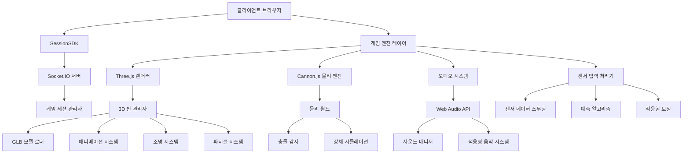

# 케이크 배달 게임 상용화 개선 설계 문서

## 개요

케이크 배달 게임을 프로토타입 수준에서 상용 가능한 수준으로 개선하기 위한 종합적인 설계 문서입니다. 3D 그래픽 품질 향상, 물리 엔진 통합, 센서 반응성 최적화, 사운드 시스템 확장 등 모든 측면에서의 전면적인 개선을 다룹니다.

## 아키텍처

### 전체 시스템 아키텍처



### 레이어 구조

1. **프레젠테이션 레이어**: UI/UX, 모바일 최적화
2. **게임 로직 레이어**: 게임 상태 관리, 밸런싱
3. **렌더링 레이어**: Three.js 기반 3D 그래픽
4. **물리 시뮬레이션 레이어**: Cannon.js 기반 물리 엔진
5. **오디오 레이어**: Web Audio API 기반 사운드 시스템
6. **입력 처리 레이어**: 센서 데이터 처리 및 최적화
7. **네트워크 레이어**: SessionSDK 기반 실시간 통신

## 컴포넌트 및 인터페이스

### 1. 3D 그래픽 시스템

#### GLB 모델 관리자
```javascript
class GLBModelManager {
    constructor() {
        this.loader = new THREE.GLTFLoader();
        this.models = new Map();
        this.animations = new Map();
    }
    
    async loadModel(path, name) {
        // GLB 모델 로드 및 캐싱
    }
    
    getModel(name) {
        // 캐시된 모델 반환
    }
    
    createAnimationMixer(model) {
        // 애니메이션 믹서 생성
    }
}
```

#### 캐릭터 애니메이션 시스템
```javascript
class CharacterAnimationSystem {
    constructor(character, mixer) {
        this.character = character;
        this.mixer = mixer;
        this.animations = {
            idle: null,
            pushing: null,
            pulling: null
        };
        this.currentAnimation = null;
    }
    
    playAnimation(name, fadeTime = 0.5) {
        // 애니메이션 전환 및 재생
    }
    
    update(deltaTime) {
        // 애니메이션 업데이트
    }
}
```

#### PBR 재질 시스템
```javascript
class PBRMaterialSystem {
    constructor() {
        this.materials = new Map();
        this.textureLoader = new THREE.TextureLoader();
    }
    
    createCakeMaterial(cakeType) {
        // 케이크 타입별 PBR 재질 생성
        const material = new THREE.MeshStandardMaterial({
            color: this.getCakeColor(cakeType),
            roughness: this.getCakeRoughness(cakeType),
            metalness: this.getCakeMetalness(cakeType),
            normalMap: this.loadTexture(`textures/${cakeType}_normal.jpg`),
            roughnessMap: this.loadTexture(`textures/${cakeType}_roughness.jpg`)
        });
        return material;
    }
}
```

### 2. 물리 엔진 시스템

#### 물리 월드 관리자
```javascript
class PhysicsWorldManager {
    constructor() {
        this.world = new CANNON.World();
        this.world.gravity.set(0, -9.82, 0);
        this.world.broadphase = new CANNON.NaiveBroadphase();
        this.world.solver.iterations = 10;
        
        this.bodies = new Map();
        this.constraints = new Map();
    }
    
    createCakeBody(cakeType, position) {
        // 케이크 타입별 물리 바디 생성
        const props = this.getCakeProperties(cakeType);
        const shape = new CANNON.Cylinder(props.radius, props.radius, props.height, 8);
        const body = new CANNON.Body({ 
            mass: props.mass,
            material: new CANNON.Material({
                friction: props.friction,
                restitution: props.restitution
            })
        });
        body.addShape(shape);
        body.position.copy(position);
        return body;
    }
    
    step(deltaTime) {
        this.world.step(deltaTime);
        this.syncVisualBodies();
    }
}
```

#### 케이크 물리 특성 시스템
```javascript
class CakePhysicsSystem {
    constructor() {
        this.cakeProperties = {
            basic: { mass: 1.0, friction: 0.5, restitution: 0.2, wobbleFactor: 1.0 },
            strawberry: { mass: 0.8, friction: 0.7, restitution: 0.1, wobbleFactor: 0.8 },
            chocolate: { mass: 1.2, friction: 0.4, restitution: 0.1, wobbleFactor: 0.7 },
            wedding: { mass: 1.5, friction: 0.3, restitution: 0.05, wobbleFactor: 0.5 },
            ice: { mass: 0.7, friction: 0.1, restitution: 0.8, wobbleFactor: 1.5 },
            bomb: { mass: 2.0, friction: 0.6, restitution: 0.4, wobbleFactor: 2.0 }
        };
    }
    
    applyCakePhysics(cakeBody, cakeType, sensorInput) {
        const props = this.cakeProperties[cakeType];
        const wobbleForce = this.calculateWobbleForce(sensorInput, props.wobbleFactor);
        cakeBody.applyForce(wobbleForce, cakeBody.position);
    }
}
```

### 3. 센서 입력 최적화 시스템

#### 센서 데이터 스무딩
```javascript
class SensorSmoothingSystem {
    constructor() {
        this.smoothingFactor = 0.8;
        this.previousData = { orientation: {}, acceleration: {} };
        this.kalmanFilters = {
            gamma: new KalmanFilter(),
            beta: new KalmanFilter(),
            alpha: new KalmanFilter()
        };
    }
    
    smoothSensorData(rawData) {
        // 칼만 필터를 사용한 센서 데이터 스무딩
        const smoothed = {
            orientation: {
                gamma: this.kalmanFilters.gamma.filter(rawData.orientation.gamma),
                beta: this.kalmanFilters.beta.filter(rawData.orientation.beta),
                alpha: this.kalmanFilters.alpha.filter(rawData.orientation.alpha)
            },
            acceleration: this.exponentialSmoothing(rawData.acceleration)
        };
        
        this.previousData = smoothed;
        return smoothed;
    }
}
```

#### 예측 알고리즘
```javascript
class SensorPredictionSystem {
    constructor() {
        this.history = [];
        this.maxHistorySize = 10;
        this.predictionHorizon = 33; // ms
    }
    
    predictNextValue(currentData, timestamp) {
        this.history.push({ data: currentData, timestamp });
        
        if (this.history.length > this.maxHistorySize) {
            this.history.shift();
        }
        
        if (this.history.length < 3) return currentData;
        
        // 선형 예측 알고리즘
        const velocity = this.calculateVelocity();
        const predictedData = this.extrapolate(currentData, velocity, this.predictionHorizon);
        
        return predictedData;
    }
}
```

### 4. 오디오 시스템

#### 적응형 음악 시스템
```javascript
class AdaptiveMusicSystem {
    constructor() {
        this.audioContext = new (window.AudioContext || window.webkitAudioContext)();
        this.musicLayers = new Map();
        this.currentIntensity = 0;
        this.targetIntensity = 0;
    }
    
    loadMusicLayers() {
        // 다층 음악 트랙 로드
        const layers = ['ambient', 'tension', 'action', 'success'];
        layers.forEach(layer => {
            this.loadAudioBuffer(`music/${layer}.mp3`, layer);
        });
    }
    
    updateIntensity(gameState) {
        // 게임 상태에 따른 음악 강도 조절
        const intensity = this.calculateIntensity(gameState);
        this.targetIntensity = intensity;
        this.smoothTransition();
    }
}
```

#### 3D 공간 오디오
```javascript
class SpatialAudioSystem {
    constructor(audioContext) {
        this.audioContext = audioContext;
        this.listener = audioContext.listener;
        this.sources = new Map();
    }
    
    createSpatialSource(audioBuffer, position) {
        const source = this.audioContext.createBufferSource();
        const panner = this.audioContext.createPanner();
        
        panner.panningModel = 'HRTF';
        panner.distanceModel = 'inverse';
        panner.refDistance = 1;
        panner.maxDistance = 10000;
        panner.rolloffFactor = 1;
        
        source.connect(panner);
        panner.connect(this.audioContext.destination);
        
        this.updateSourcePosition(panner, position);
        
        return { source, panner };
    }
}
```

### 5. UI/UX 최적화 시스템

#### 모바일 터치 인터페이스
```javascript
class MobileTouchInterface {
    constructor() {
        this.touchSensitivity = 1.0;
        this.hapticFeedback = 'vibrate' in navigator;
        this.gestureRecognizer = new GestureRecognizer();
    }
    
    setupTouchControls() {
        // 터치 제스처 설정
        this.gestureRecognizer.on('tap', this.handleTap.bind(this));
        this.gestureRecognizer.on('swipe', this.handleSwipe.bind(this));
        this.gestureRecognizer.on('pinch', this.handlePinch.bind(this));
    }
    
    provideTouchFeedback(type) {
        if (this.hapticFeedback) {
            const patterns = {
                light: [50],
                medium: [100],
                heavy: [200],
                success: [50, 50, 100],
                error: [100, 50, 100, 50, 100]
            };
            navigator.vibrate(patterns[type] || patterns.light);
        }
    }
}
```

#### 접근성 시스템
```javascript
class AccessibilitySystem {
    constructor() {
        this.colorBlindSupport = true;
        this.highContrastMode = false;
        this.fontSize = 'normal';
        this.screenReader = this.detectScreenReader();
    }
    
    applyColorBlindSupport() {
        // 색맹 지원을 위한 색상 조정
        const colorMappings = {
            red: '#FF6B6B',
            green: '#4ECDC4',
            blue: '#45B7D1',
            yellow: '#FFA07A'
        };
        
        this.updateColorScheme(colorMappings);
    }
    
    updateFontSize(size) {
        const scaleFactor = {
            small: 0.8,
            normal: 1.0,
            large: 1.2,
            xlarge: 1.5
        }[size];
        
        document.documentElement.style.fontSize = `${16 * scaleFactor}px`;
    }
}
```

### 6. 튜토리얼 시스템

#### 인터랙티브 튜토리얼 관리자
```javascript
class InteractiveTutorialManager {
    constructor(gameEngine) {
        this.gameEngine = gameEngine;
        this.currentStep = 0;
        this.tutorialSteps = [];
        this.overlay = null;
        this.highlightSystem = new HighlightSystem();
    }
    
    createTutorialStep(config) {
        return {
            id: config.id,
            title: config.title,
            description: config.description,
            target: config.target,
            action: config.action,
            validation: config.validation,
            onComplete: config.onComplete
        };
    }
    
    startTutorial() {
        this.currentStep = 0;
        this.showTutorialOverlay();
        this.executeCurrentStep();
    }
    
    executeCurrentStep() {
        const step = this.tutorialSteps[this.currentStep];
        this.highlightSystem.highlight(step.target);
        this.showStepInstructions(step);
        this.waitForUserAction(step);
    }
}
```

### 7. 성능 최적화 시스템

#### LOD (Level of Detail) 시스템
```javascript
class LODSystem {
    constructor(camera) {
        this.camera = camera;
        this.lodObjects = new Map();
        this.lodLevels = [
            { distance: 10, quality: 'high' },
            { distance: 25, quality: 'medium' },
            { distance: 50, quality: 'low' }
        ];
    }
    
    registerLODObject(object, lodMeshes) {
        this.lodObjects.set(object, {
            meshes: lodMeshes,
            currentLOD: 0
        });
    }
    
    updateLOD() {
        this.lodObjects.forEach((lodData, object) => {
            const distance = this.camera.position.distanceTo(object.position);
            const newLOD = this.calculateLODLevel(distance);
            
            if (newLOD !== lodData.currentLOD) {
                this.switchLOD(object, lodData, newLOD);
            }
        });
    }
}
```

#### 오브젝트 풀링 시스템
```javascript
class ObjectPoolingSystem {
    constructor() {
        this.pools = new Map();
    }
    
    createPool(type, factory, initialSize = 10) {
        const pool = {
            objects: [],
            factory: factory,
            active: new Set(),
            inactive: []
        };
        
        // 초기 오브젝트 생성
        for (let i = 0; i < initialSize; i++) {
            const obj = factory();
            obj.poolType = type;
            pool.objects.push(obj);
            pool.inactive.push(obj);
        }
        
        this.pools.set(type, pool);
    }
    
    acquire(type) {
        const pool = this.pools.get(type);
        if (!pool) return null;
        
        let obj = pool.inactive.pop();
        if (!obj) {
            obj = pool.factory();
            obj.poolType = type;
            pool.objects.push(obj);
        }
        
        pool.active.add(obj);
        return obj;
    }
    
    release(obj) {
        const pool = this.pools.get(obj.poolType);
        if (!pool) return;
        
        pool.active.delete(obj);
        pool.inactive.push(obj);
        this.resetObject(obj);
    }
}
```

### 8. 파티클 시스템

#### 고급 파티클 효과
```javascript
class AdvancedParticleSystem {
    constructor(scene) {
        this.scene = scene;
        this.particleSystems = new Map();
        this.textureLoader = new THREE.TextureLoader();
    }
    
    createCelebrationEffect(position) {
        const particleCount = 100;
        const geometry = new THREE.BufferGeometry();
        const positions = new Float32Array(particleCount * 3);
        const velocities = new Float32Array(particleCount * 3);
        const colors = new Float32Array(particleCount * 3);
        
        for (let i = 0; i < particleCount; i++) {
            const i3 = i * 3;
            
            // 초기 위치
            positions[i3] = position.x + (Math.random() - 0.5) * 2;
            positions[i3 + 1] = position.y + Math.random() * 2;
            positions[i3 + 2] = position.z + (Math.random() - 0.5) * 2;
            
            // 초기 속도
            velocities[i3] = (Math.random() - 0.5) * 10;
            velocities[i3 + 1] = Math.random() * 15 + 5;
            velocities[i3 + 2] = (Math.random() - 0.5) * 10;
            
            // 색상
            const hue = Math.random();
            const color = new THREE.Color().setHSL(hue, 1, 0.5);
            colors[i3] = color.r;
            colors[i3 + 1] = color.g;
            colors[i3 + 2] = color.b;
        }
        
        geometry.setAttribute('position', new THREE.BufferAttribute(positions, 3));
        geometry.setAttribute('velocity', new THREE.BufferAttribute(velocities, 3));
        geometry.setAttribute('color', new THREE.BufferAttribute(colors, 3));
        
        const material = new THREE.PointsMaterial({
            size: 0.1,
            vertexColors: true,
            transparent: true,
            opacity: 0.8
        });
        
        const particles = new THREE.Points(geometry, material);
        this.scene.add(particles);
        
        return particles;
    }
}
```

## 데이터 모델

### 게임 상태 모델
```javascript
class GameState {
    constructor() {
        this.mode = 'menu'; // menu, playing, paused, gameOver
        this.score = 0;
        this.level = 1;
        this.timeLeft = 60;
        this.cakeType = 'basic';
        this.difficulty = 1.0;
        this.playerCount = 1;
        this.physics = {
            gravity: -9.82,
            airResistance: 0.1,
            windForce: { x: 0, y: 0, z: 0 }
        };
    }
}
```

### 케이크 데이터 모델
```javascript
class CakeModel {
    constructor(type) {
        this.type = type;
        this.properties = this.getCakeProperties(type);
        this.position = new THREE.Vector3();
        this.rotation = new THREE.Euler();
        this.velocity = new THREE.Vector3();
        this.angularVelocity = new THREE.Vector3();
        this.health = 100;
        this.stability = 1.0;
    }
    
    getCakeProperties(type) {
        const properties = {
            basic: {
                mass: 1.0,
                friction: 0.5,
                restitution: 0.2,
                wobbleFactor: 1.0,
                color: 0xFFD7A0,
                texture: 'basic_cake.jpg',
                points: 10
            },
            // ... 다른 케이크 타입들
        };
        return properties[type] || properties.basic;
    }
}
```

### 센서 데이터 모델
```javascript
class SensorDataModel {
    constructor() {
        this.raw = {
            orientation: { alpha: 0, beta: 0, gamma: 0 },
            acceleration: { x: 0, y: 0, z: 0 },
            rotationRate: { alpha: 0, beta: 0, gamma: 0 }
        };
        this.smoothed = {
            orientation: { alpha: 0, beta: 0, gamma: 0 },
            acceleration: { x: 0, y: 0, z: 0 }
        };
        this.predicted = {
            orientation: { alpha: 0, beta: 0, gamma: 0 },
            acceleration: { x: 0, y: 0, z: 0 }
        };
        this.timestamp = 0;
        this.latency = 0;
    }
}
```

## 오류 처리

### 네트워크 오류 처리
```javascript
class NetworkErrorHandler {
    constructor(sdk) {
        this.sdk = sdk;
        this.reconnectAttempts = 0;
        this.maxReconnectAttempts = 5;
        this.reconnectDelay = 1000;
    }
    
    handleDisconnection() {
        console.log('연결이 끊어졌습니다. 재연결을 시도합니다...');
        this.attemptReconnection();
    }
    
    async attemptReconnection() {
        if (this.reconnectAttempts >= this.maxReconnectAttempts) {
            this.showConnectionFailedDialog();
            return;
        }
        
        this.reconnectAttempts++;
        
        try {
            await this.sdk.reconnect();
            this.reconnectAttempts = 0;
            this.showReconnectionSuccess();
        } catch (error) {
            setTimeout(() => {
                this.attemptReconnection();
            }, this.reconnectDelay * this.reconnectAttempts);
        }
    }
}
```

### 메모리 관리
```javascript
class MemoryManager {
    constructor() {
        this.memoryThreshold = 100 * 1024 * 1024; // 100MB
        this.cleanupInterval = 30000; // 30초
        this.startMonitoring();
    }
    
    startMonitoring() {
        setInterval(() => {
            if (performance.memory && performance.memory.usedJSHeapSize > this.memoryThreshold) {
                this.performCleanup();
            }
        }, this.cleanupInterval);
    }
    
    performCleanup() {
        // 사용하지 않는 텍스처 정리
        this.cleanupTextures();
        
        // 사용하지 않는 지오메트리 정리
        this.cleanupGeometries();
        
        // 파티클 시스템 정리
        this.cleanupParticles();
        
        // 강제 가비지 컬렉션 (가능한 경우)
        if (window.gc) {
            window.gc();
        }
    }
}
```

## 테스팅 전략

### 단위 테스트
- 물리 시뮬레이션 정확성 테스트
- 센서 데이터 스무딩 알고리즘 테스트
- 오디오 시스템 기능 테스트
- UI 컴포넌트 반응성 테스트

### 통합 테스트
- SessionSDK와 게임 엔진 통합 테스트
- 3D 렌더링과 물리 엔진 동기화 테스트
- 멀티플레이어 세션 관리 테스트

### 성능 테스트
- 다양한 모바일 기기에서의 프레임레이트 테스트
- 메모리 사용량 모니터링
- 네트워크 지연 시뮬레이션 테스트
- 배터리 소모량 측정

### 사용자 경험 테스트
- 접근성 기능 검증
- 터치 인터페이스 사용성 테스트
- 다양한 화면 크기에서의 UI 테스트
- 색맹 사용자를 위한 색상 대비 테스트

## 배포 및 모니터링

### 성능 모니터링
```javascript
class PerformanceMonitor {
    constructor() {
        this.metrics = {
            fps: 0,
            memoryUsage: 0,
            renderTime: 0,
            physicsTime: 0,
            networkLatency: 0
        };
        this.startMonitoring();
    }
    
    startMonitoring() {
        // FPS 모니터링
        this.monitorFPS();
        
        // 메모리 사용량 모니터링
        this.monitorMemory();
        
        // 렌더링 시간 모니터링
        this.monitorRenderTime();
        
        // 네트워크 지연 모니터링
        this.monitorNetworkLatency();
    }
    
    reportMetrics() {
        // 성능 지표를 서버로 전송
        if (this.shouldReport()) {
            this.sendMetricsToServer(this.metrics);
        }
    }
}
```

### 오류 리포팅
```javascript
class ErrorReporter {
    constructor() {
        this.errorQueue = [];
        this.maxQueueSize = 50;
        this.reportInterval = 60000; // 1분
        this.setupErrorHandlers();
    }
    
    setupErrorHandlers() {
        window.addEventListener('error', (event) => {
            this.captureError({
                type: 'javascript',
                message: event.message,
                filename: event.filename,
                lineno: event.lineno,
                colno: event.colno,
                stack: event.error?.stack,
                timestamp: Date.now()
            });
        });
        
        window.addEventListener('unhandledrejection', (event) => {
            this.captureError({
                type: 'promise',
                message: event.reason?.message || 'Unhandled Promise Rejection',
                stack: event.reason?.stack,
                timestamp: Date.now()
            });
        });
    }
}
```

이 설계 문서는 케이크 배달 게임의 상용화를 위한 종합적인 기술적 접근 방식을 제시합니다. 각 시스템은 모듈화되어 있어 독립적으로 개발하고 테스트할 수 있으며, 전체적으로는 통합된 게임 경험을 제공합니다.