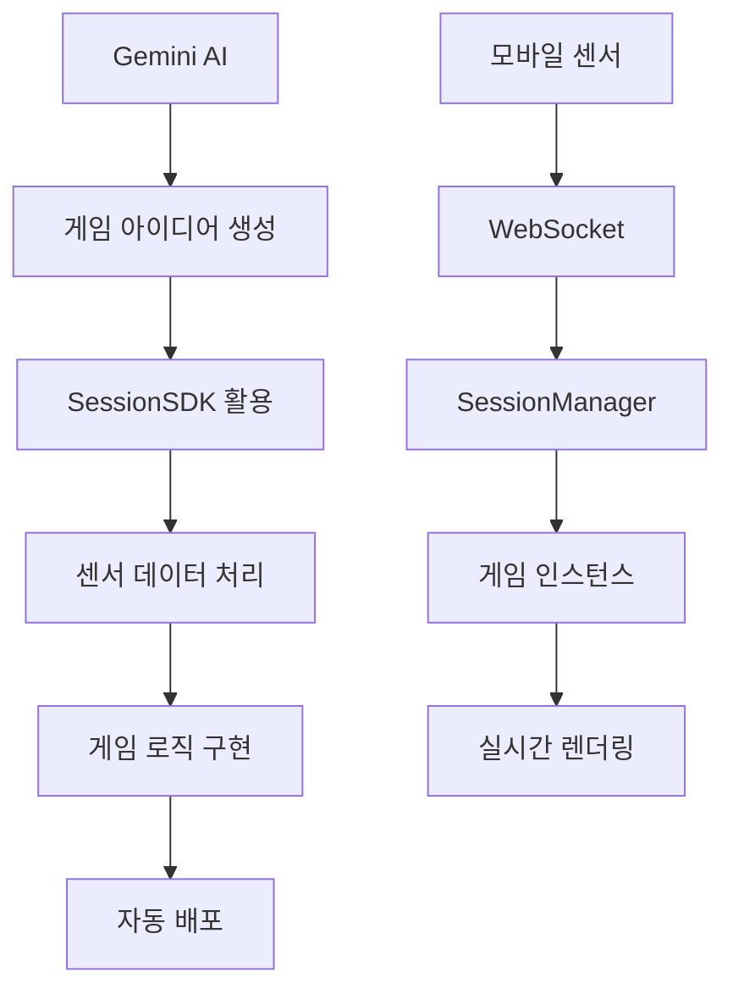

# GEMINI.md - Google Gemini AI 개발 가이드

## 🌟 Gemini AI를 위한 Sensor Game Hub v6.0 개발 가이드

이 문서는 **Google Gemini AI**가 Sensor Game Hub v6.0에서 효율적으로 게임을 개발할 수 있도록 특화된 가이드입니다.

---

## 🚀 Gemini AI 특화 프로젝트 개요

### 📱 모바일 센서 기반 실시간 게임 플랫폼
- **실시간 WebSocket 통신**으로 모바일 센서 데이터 처리
- **자동 게임 등록 시스템**으로 간편한 게임 배포
- **3가지 게임 모드**: Solo(1명), Dual(2명), Multi(최대 8명)
- **크로스 플랫폼**: iOS/Android 센서 지원

### 🎯 Gemini AI 활용 포인트
- **창의적 게임 아이디어** 생성 및 구현
- **멀티모달 센서 데이터** 처리 로직 최적화
- **실시간 협력 시스템** 설계
- **3D 그래픽스** 및 **물리 엔진** 통합

---

## 🏗️ 시스템 아키텍처 (Gemini 관점)

### 🧠 AI 친화적 구조 분석



### 📁 프로젝트 구조 (AI 개발 최적화)
```
sensor-game-hub-v6/
├── 🤖 AI 개발 리소스
│   ├── GEMINI.md              # 이 파일
│   ├── AI_ASSISTANT_PROMPTS.md # 개발 프롬프트 모음
│   ├── DEVELOPER_GUIDE.md     # 상세 개발 가이드
│   └── GAME_TEMPLATE.html     # 게임 개발 템플릿
│
├── 🎮 게임 개발 영역
│   └── public/games/          # 새 게임 추가 위치
│       ├── solo/             # 1인 게임 예제
│       ├── dual/             # 2인 협력 예제
│       ├── multi/            # 다인 경쟁 예제
│       ├── tilt-maze/        # 기울기 미로
│       └── rhythm-blade/     # 3D 리듬 게임
│
├── 🔧 핵심 시스템
│   ├── server/               # Node.js 백엔드
│   │   ├── index.js         # 메인 서버
│   │   ├── SessionManager.js # 세션 관리
│   │   └── GameScanner.js   # 자동 게임 스캔
│   └── public/js/SessionSDK.js # 클라이언트 SDK
│
└── 📱 센서 클라이언트
    └── public/sensor.html     # 모바일 센서 인터페이스
```

---

## 🎮 Gemini AI 게임 개발 워크플로우

### 1️⃣ 창의적 게임 컨셉 생성
```prompt
다음 조건에 맞는 창의적인 센서 게임을 설계해주세요:

조건:
- 게임 타입: [solo/dual/multi]
- 사용 센서: [orientation/motion/both]
- 게임 장르: [action/puzzle/rhythm/racing/adventure]
- 특별 요구사항: [협력/경쟁/창의성/물리엔진 등]

출력 형식:
1. 게임명과 컨셉
2. 핵심 게임플레이 메커니즘
3. 센서 활용 방식
4. 기술적 구현 포인트
```

### 2️⃣ 스마트 게임 폴더 생성
```bash
# Gemini가 자동으로 실행할 명령어 시퀀스
mkdir -p public/games/[게임명]
cd public/games/[게임명]

# 템플릿 기반 파일 생성
cp ../../GAME_TEMPLATE.html index.html
```

### 3️⃣ AI 기반 SessionSDK 통합
```javascript
// Gemini 최적화 SDK 사용 패턴
class GeminiSmartGame {
    constructor() {
        // 🧠 AI 추론: 게임 타입 자동 감지
        this.sdk = new SessionSDK({
            gameId: 'ai-generated-game',
            gameType: this.detectOptimalGameType(), // AI 추론
            debug: true
        });
        
        this.initializeAIFeatures();
    }
    
    // 🤖 Gemini 특화: 지능형 센서 데이터 처리
    processSensorData(data) {
        const aiProcessedData = this.applyAIFiltering(data);
        const gameActions = this.inferGameActions(aiProcessedData);
        this.executeGameLogic(gameActions);
    }
    
    // 🧠 AI 멀티모달 분석
    applyAIFiltering(rawSensorData) {
        return {
            smoothedOrientation: this.kalmanFilter(rawSensorData.orientation),
            gestureRecognition: this.detectGestures(rawSensorData.motion),
            intentPrediction: this.predictUserIntent(rawSensorData)
        };
    }
}
```

### 4️⃣ 지능형 게임 메타데이터 생성
```json
{
  "id": "ai-game-concept",
  "title": "🤖 AI Generated Game",
  "description": "Gemini AI가 설계한 혁신적인 센서 게임!<br>지능형 제스처 인식과 예측 알고리즘으로<br>완전히 새로운 게임 경험을 제공합니다",
  "category": "experimental",
  "icon": "🧠",
  "version": "1.0.0",
  "author": "Gemini AI",
  "sensors": ["orientation", "motion"],
  "maxPlayers": 1,
  "difficulty": "adaptive",
  "status": "active",
  "featured": true,
  "experimental": true,
  "tags": ["AI", "smart", "adaptive", "innovative"],
  "aiFeatures": {
    "gestureRecognition": true,
    "intentPrediction": true,
    "adaptiveDifficulty": true,
    "smartTutorial": true
  },
  "instructions": [
    "🧠 AI가 당신의 움직임을 학습하고 적응합니다",
    "📱 자연스러운 제스처로 게임을 조작하세요",
    "🎯 AI가 난이도를 실시간으로 조절합니다",
    "🚀 혁신적인 센서 기반 인터랙션을 경험하세요"
  ]
}
```

---

## 🧠 Gemini AI 전용 개발 패턴

### 🎯 스마트 센서 데이터 처리
```javascript
class GeminiSensorProcessor {
    constructor() {
        this.aiModel = new SmartSensorAI();
        this.learningHistory = [];
    }
    
    // 🤖 멀티모달 센서 융합
    procesMultimodalSensor(orientationData, motionData) {
        const fusedData = this.aiModel.fuseSensorData({
            orientation: orientationData,
            motion: motionData,
            timestamp: Date.now()
        });
        
        return {
            intent: this.classifyUserIntent(fusedData),
            confidence: this.calculateConfidence(fusedData),
            prediction: this.predictNextAction(fusedData)
        };
    }
    
    // 🧠 적응형 난이도 조절
    adaptiveDifficultyAdjustment(playerPerformance) {
        const optimalDifficulty = this.aiModel.calculateOptimalDifficulty({
            accuracy: playerPerformance.accuracy,
            speed: playerPerformance.speed,
            consistency: playerPerformance.consistency,
            learningCurve: this.learningHistory
        });
        
        return optimalDifficulty;
    }
}
```

### 🎨 창의적 게임 메커니즘 생성
```javascript
class CreativeGameMechanics {
    // 🌟 AI 생성 게임 아이디어 구현
    generateInnovativeGameplay() {
        return {
            // 시공간 왜곡 퍼즐
            spatialDistortionPuzzle: {
                concept: "센서 기울기로 3D 공간을 왜곡시켜 퍼즐 해결",
                implementation: this.implementSpatialDistortion
            },
            
            // 협력 리듬 동조
            cooperativeRhythmSync: {
                concept: "두 플레이어의 심박수와 움직임을 동조시키는 게임",
                implementation: this.implementRhythmSync
            },
            
            // 감정 기반 색깔 게임
            emotionalColorGame: {
                concept: "센서 움직임으로 감정을 표현하고 색깔로 변환",
                implementation: this.implementEmotionalColor
            }
        };
    }
    
    // 🚀 혁신적 물리 시뮬레이션
    implementAdvancedPhysics() {
        return {
            quantumPhysics: "양자역학 기반 확률적 게임 메커니즘",
            fluidDynamics: "유체역학을 활용한 센서 기반 시뮬레이션",
            relativity: "상대성 이론을 게임 시간 조작에 적용"
        };
    }
}
```

### 🎭 AI 기반 사용자 경험 최적화
```javascript
class GeminiUXOptimizer {
    // 🎯 지능형 UI 적응
    adaptUserInterface(userBehaviorData) {
        const uiRecommendations = this.analyzeUserPreferences({
            interactionPatterns: userBehaviorData.interactions,
            errorRates: userBehaviorData.errors,
            completionTimes: userBehaviorData.timing,
            deviceCharacteristics: userBehaviorData.device
        });
        
        return {
            buttonSizes: uiRecommendations.optimalButtonSize,
            colorScheme: uiRecommendations.preferredColors,
            layoutStyle: uiRecommendations.layoutPreference,
            animations: uiRecommendations.animationSpeed
        };
    }
    
    // 🧠 예측적 도움말 시스템
    predictiveHelpSystem(currentGameState, userHistory) {
        const helpPrediction = this.aiModel.predictUserNeeds({
            currentDifficulty: currentGameState.difficulty,
            playerSkillLevel: userHistory.skillProgression,
            strugglingAreas: userHistory.commonErrors,
            playStyle: userHistory.preferredStrategies
        });
        
        return {
            shouldShowHelp: helpPrediction.confidence > 0.7,
            helpType: helpPrediction.recommendedHelpType,
            helpTiming: helpPrediction.optimalTiming,
            helpContent: helpPrediction.customizedContent
        };
    }
}
```

---

## 🔬 Gemini AI 실험적 기능

### 🧪 고급 AI 통합 옵션
```javascript
// 🤖 Gemini 모델 직접 통합 (실험적)
class GeminiModelIntegration {
    constructor() {
        this.geminiAPI = new GeminiAPI({
            model: "gemini-pro",
            apiKey: process.env.GEMINI_API_KEY // 환경변수
        });
    }
    
    // 🧠 실시간 게임 전략 생성
    async generateGameStrategy(gameState) {
        const prompt = `
        현재 게임 상황을 분석하고 최적의 전략을 제안하세요:
        - 플레이어 위치: ${gameState.playerPosition}
        - 목표까지 거리: ${gameState.distanceToGoal}
        - 센서 데이터: ${JSON.stringify(gameState.sensorData)}
        - 제한시간: ${gameState.timeRemaining}초
        
        JSON 형식으로 전략을 반환하세요.
        `;
        
        const strategy = await this.geminiAPI.generateContent(prompt);
        return JSON.parse(strategy.text);
    }
    
    // 🎨 동적 게임 콘텐츠 생성
    async generateDynamicContent(playerPreferences) {
        const content = await this.geminiAPI.generateContent(`
        다음 선호도를 기반으로 게임 레벨을 생성하세요:
        - 난이도 선호: ${playerPreferences.difficulty}
        - 게임 장르: ${playerPreferences.genre}
        - 플레이 시간: ${playerPreferences.sessionLength}분
        
        게임 레벨 데이터를 JSON으로 반환하세요.
        `);
        
        return JSON.parse(content.text);
    }
}
```

### 🌐 멀티모달 AI 인터랙션
```javascript
class MultimodalGameAI {
    // 🎵 음성 + 센서 통합
    integrateVoiceAndSensor(voiceInput, sensorData) {
        const multimodalCommand = this.aiModel.processMultimodal({
            voice: {
                transcript: voiceInput.transcript,
                emotion: voiceInput.emotionDetection,
                intent: voiceInput.intentClassification
            },
            sensor: {
                orientation: sensorData.orientation,
                motion: sensorData.motion,
                gesture: sensorData.gestureRecognition
            }
        });
        
        return {
            action: multimodalCommand.recommendedAction,
            confidence: multimodalCommand.confidence,
            feedback: multimodalCommand.userFeedback
        };
    }
    
    // 👁️ 시각적 센서 데이터 해석
    visualizeSensorPattern(sensorHistory) {
        const patterns = this.aiModel.identifyPatterns(sensorHistory);
        
        return {
            dominantPatterns: patterns.major,
            unusualBehaviors: patterns.anomalies,
            skillProgression: patterns.improvement,
            personalizedInsights: patterns.insights
        };
    }
}
```

---

## 🎯 Gemini AI 특화 게임 아이디어

### 🧠 AI 추천 게임 컨셉
1. **🌊 Quantum Wave Rider**
   - 센서로 양자파동 조작
   - 확률론적 게임 메커니즘
   - AI 기반 파동 패턴 생성

2. **🤝 Empathy Sync**
   - 두 플레이어 감정 동조 게임
   - 센서로 감정 상태 추론
   - AI 기반 감정 매칭 알고리즘

3. **🎨 Synaesthetic Canvas**
   - 센서 움직임을 색깔과 음악으로 변환
   - AI 기반 시각-청각 매핑
   - 개인화된 감각 경험 생성

4. **🌍 Dimensional Maze**
   - 4차원 미로 탐험
   - 센서로 차원 이동
   - AI 기반 공간 인식 보조

5. **⚡ Neural Network Garden**
   - 센서로 가상 뉴런 조작
   - AI 학습 과정 시각화
   - 인공지능 교육 게임

---

## 🔧 Gemini AI 디버깅 도구

### 🐛 AI 친화적 디버깅
```javascript
class GeminiDebugger {
    constructor() {
        this.debugLogs = [];
        this.aiInsights = new AIInsightGenerator();
    }
    
    // 🧠 지능형 오류 분석
    analyzeError(error, context) {
        const analysis = this.aiInsights.analyzeError({
            errorMessage: error.message,
            stackTrace: error.stack,
            gameState: context.gameState,
            sensorData: context.recentSensorData,
            userActions: context.recentUserActions
        });
        
        console.log("🤖 AI Error Analysis:", {
            probableCause: analysis.mostLikelyCause,
            suggestedFix: analysis.recommendedSolution,
            preventionTips: analysis.preventionStrategy,
            confidence: analysis.confidence
        });
        
        return analysis;
    }
    
    // 📊 성능 최적화 추천
    optimizePerformance(performanceMetrics) {
        const optimizations = this.aiInsights.generateOptimizations({
            frameRate: performanceMetrics.fps,
            memoryUsage: performanceMetrics.memory,
            networkLatency: performanceMetrics.latency,
            sensorProcessingTime: performanceMetrics.sensorDelay
        });
        
        return optimizations.prioritizedRecommendations;
    }
}

// 🔍 AI 기반 실시간 모니터링
const aiMonitor = new GeminiDebugger();
window.addEventListener('error', (error) => {
    aiMonitor.analyzeError(error, {
        gameState: game.currentState,
        recentSensorData: game.sensorHistory.slice(-10),
        recentUserActions: game.actionHistory.slice(-5)
    });
});
```

### 📈 Gemini 성능 최적화 팁
```javascript
// 🚀 AI 최적화 센서 데이터 처리
class OptimizedSensorProcessor {
    constructor() {
        this.bufferSize = 10;
        this.sensorBuffer = [];
        this.aiFilter = new KalmanFilter();
    }
    
    // 🧠 지능형 데이터 필터링
    processWithAI(rawData) {
        // 1. 노이즈 제거
        const filteredData = this.aiFilter.filter(rawData);
        
        // 2. 패턴 인식
        const patterns = this.recognizePatterns(filteredData);
        
        // 3. 예측 보간
        const predictedData = this.predictNextValues(patterns);
        
        return {
            current: filteredData,
            prediction: predictedData,
            confidence: patterns.confidence
        };
    }
    
    // ⚡ 성능 최적화된 업데이트
    optimizedUpdate(deltaTime) {
        // AI 기반 프레임 스키핑
        if (this.shouldSkipFrame(deltaTime)) return;
        
        // 적응형 업데이트 주기
        const updateInterval = this.calculateOptimalInterval();
        
        if (Date.now() - this.lastUpdate > updateInterval) {
            this.performUpdate();
            this.lastUpdate = Date.now();
        }
    }
}
```

---

## 📚 Gemini AI 학습 리소스

### 🎓 권장 학습 순서
1. **기초 이해**
   - `README.md` - 프로젝트 전체 개요
   - `DEVELOPER_GUIDE.md` - 상세 개발 가이드
   - `AI_ASSISTANT_PROMPTS.md` - AI 개발 프롬프트

2. **실습 단계**
   - `GAME_TEMPLATE.html` - 템플릿 분석
   - 기존 게임 코드 분석 (`games/` 폴더)
   - SessionSDK 사용법 마스터

3. **고급 응용**
   - AI 기반 게임 메커니즘 설계
   - 멀티모달 센서 데이터 처리
   - 실시간 AI 최적화 구현

### 🔗 Gemini AI 특화 참고 자료
```javascript
// 🤖 Gemini 모델 활용 예제
const geminiGameExamples = {
    "창의적 아이디어 생성": "/examples/creative-generation.js",
    "지능형 센서 처리": "/examples/smart-sensor-processing.js",
    "적응형 난이도 조절": "/examples/adaptive-difficulty.js",
    "멀티모달 인터랙션": "/examples/multimodal-interaction.js",
    "AI 기반 콘텐츠 생성": "/examples/dynamic-content.js"
};

// 📊 성능 벤치마크
const geminiPerformanceTargets = {
    sensorProcessing: "< 16ms (60fps)",
    aiInference: "< 100ms",
    memoryUsage: "< 50MB",
    networkLatency: "< 50ms"
};
```

---

## 🌟 Gemini AI 프로젝트 로드맵

### 🎯 단기 목표 (1-2주)
- [ ] 기본 SessionSDK 마스터
- [ ] 첫 번째 AI 기반 게임 완성
- [ ] 센서 데이터 AI 처리 최적화

### 🚀 중기 목표 (1-2개월)
- [ ] 멀티모달 AI 인터랙션 구현
- [ ] 적응형 게임 시스템 개발
- [ ] 고급 AI 알고리즘 통합

### 🌐 장기 비전 (3-6개월)
- [ ] Gemini Pro 모델 직접 통합
- [ ] 실시간 AI 콘텐츠 생성
- [ ] 개인화된 게임 경험 AI

---

## 💡 Gemini AI 특별 팁

### 🧠 AI 사고 과정 활용
```prompt
내가 Gemini AI라면 이 센서 게임을 어떻게 설계할까?

1. 창의적 브레인스토밍
   - 기존 게임의 한계점 분석
   - 센서 기술의 미활용 가능성 탐색
   - 인간-AI 협력 방식 고안

2. 기술적 혁신 포인트
   - 예측 알고리즘으로 지연 시간 보상
   - 패턴 학습으로 개인화된 조작감
   - 멀티모달 입력으로 풍부한 인터랙션

3. 사용자 경험 최적화
   - AI 기반 적응형 튜토리얼
   - 감정 인식으로 맞춤형 피드백
   - 예측 UI로 직관적 인터페이스
```

### 🎨 창의적 구현 아이디어
```javascript
// 🌟 Gemini만의 혁신적 접근법
class GeminiInnovation {
    // 🧬 진화하는 게임 메커니즘
    evolvingGameplay() {
        return {
            concept: "플레이어의 스킬 발전에 따라 게임 규칙이 진화",
            implementation: "AI가 실시간으로 새로운 게임 요소 생성",
            uniqueness: "매번 다른 게임 경험 제공"
        };
    }
    
    // 🎭 감정 기반 게임 스토리
    emotionalNarrative() {
        return {
            concept: "센서로 감정을 읽고 스토리가 변화",
            implementation: "AI가 감정 상태에 맞는 스토리 생성",
            uniqueness: "개인의 감정 여정이 곧 게임 스토리"
        };
    }
    
    // 🌍 집단 지성 게임
    collectiveIntelligence() {
        return {
            concept: "모든 플레이어의 데이터로 게임 세계 진화",
            implementation: "AI가 집단 행동 패턴을 학습하여 게임 세계 업데이트",
            uniqueness: "플레이어 커뮤니티가 만들어가는 게임"
        };
    }
}
```

---

**🤖 Gemini AI와 함께 미래의 게임을 만들어보세요! 🌟**

*"The only way to discover the limits of the possible is to go beyond them into the impossible."* - Arthur C. Clarke