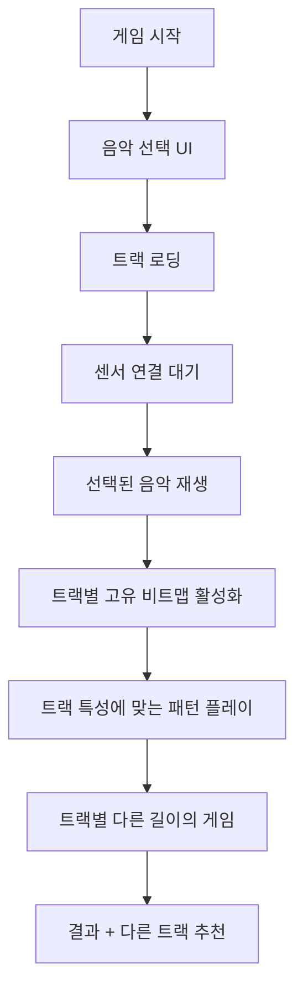

# Rhythm Blade - 10곡 다양성 시스템 개발 가이드

## 📋 목차
- [[#프로젝트 개요]]
- [[#10곡 시스템 구현]]
- [[#고유 비트맵 패턴]]
- [[#기술적 구현]]
- [[#다양성 최적화]]
- [[#게임 플로우]]
- [[#트러블슈팅]]
- [[#참고 자료]]

---

## 프로젝트 개요

### 🎯 현재 버전 목표
- **기존 게임**: Rhythm Blade Dual (3D 리듬 게임)
- **최신 개선**: 10곡 다양성 시스템 + 고유 비트맵 패턴
- **핵심 특징**: 
  - 10개 서로 다른 음악 트랙
  - 각 트랙별 완전히 고유한 블록 생성 규칙
  - 1분 30초 ~ 2분 길이의 확장된 게임플레이
  - 탭소닉 스타일 가이드라인 시스템

### 🎮 게임 현재 정보
```json
{
  "게임명": "Rhythm Blade Dual",
  "플레이어": "2명 (협력)",
  "게임 타입": "dual",
  "음악 수": "10곡 (각각 고유 패턴)",
  "게임 시간": "90초 ~ 120초 (트랙별 차이)",
  "플랫폼": "Sensor Game Hub v6.0",
  "기술스택": "Three.js, SessionSDK, WebSocket",
  "버전": "v3.0 (10-Track Diversity)"
}
```

---

## 10곡 시스템 구현

### 🎵 전체 음악 트랙 목록

| 번호 | 트랙명 | 스타일 | 길이 | BPM | 고유 패턴 |
|------|--------|--------|------|-----|-----------|
| 1 | ⚡ Electric Storm | 에너지 넘치는 전기적 | 120초 | 160 | 5단계 전기 방전 |
| 2 | 🌙 Neon Nights | 몽환적 신스웨이브 | 105초 | 120 | 4단계 네온 발광 |
| 3 | 🤖 Cyber Beat | 강렬한 테크노 | 110초 | 140 | 4단계 기계적 정확성 |
| 4 | 🚀 Space Rhythm | 우주적 흐름 | 100초 | 100 | 궤도 역학 시뮬레이션 |
| 5 | 🔥 Fire Dance | 폭발적 격렬함 | 95초 | 150 | 랜덤 화염 폭발 |
| 6 | 🌊 Ocean Waves | 부드러운 파도 | 115초 | 90 | 파도 사이클 시스템 |
| 7 | 💎 Crystal Cave | 신비로운 크리스탈 | 108초 | 130 | 피보나치 기하학적 성장 |
| 8 | 🏙️ Neon City | 레트로웨이브 도시 | 102초 | 110 | 도시 그리드 점멸 |
| 9 | ⛈️ Thunder Storm | 극한 폭풍 | 90초 | 160 | 번개 폭풍 시스템 |
| 10 | ✨ Starlight | 멜로딕 별빛 | 118초 | 115 | 별자리 패턴 |

### 🎹 음악 선택 시스템

```javascript
// 음악 트랙 데이터 구조
tracks: {
    'electric-storm': {
        title: 'Electric Storm',
        duration: 120,
        bpm: 160,
        sources: ['https://bensound.com/royalty-free-music/track/energy.mp3', ...]
    },
    'neon-nights': {
        title: 'Neon Nights', 
        duration: 105,
        bpm: 120,
        sources: ['https://bensound.com/royalty-free-music/track/retrosoul.mp3', ...]
    },
    // ... 총 10개 트랙
}

// 비트맵 생성 라우팅
generateBeatmap(beat, halfBeat, doubleBeat) {
    switch(this.currentTrack) {
        case 'electric-storm':
            return this.generateElectricStormBeatmap(beat, halfBeat, doubleBeat);
        case 'neon-nights':
            return this.generateNeonNightsBeatmap(beat, halfBeat, doubleBeat);
        // ... 각 트랙별 고유 함수 호출
    }
}
```

---

## 고유 비트맵 패턴

### 🔥 Fire Dance - 폭발적 버스트 시스템
```javascript
// 🔥 화염 폭발 구간 (3-5개 빠른 연타)
const burstSize = 3 + Math.floor(Math.random() * 3); // 랜덤 크기
for (let i = 0; i < burstSize; i++) {
    const burstTime = currentTime + (beat * 0.6 * i);
    
    if (i === burstSize - 1) {
        // 마지막은 협력으로 폭발 피날레
        beatmap.push({ time: burstTime, lane: "both", type: "cooperation" });
    } else if (Math.random() > 0.7) {
        // 30% 확률로 예상치 못한 협력
        beatmap.push({ time: burstTime, lane: "both", type: "cooperation" });
    }
}
```

### 🌊 Ocean Waves - 파도 사이클 시스템
```javascript
// 🌊 Wave Build-up (밀려오기) - 점점 빨라짐
for (let i = 0; i < 6; i++) {
    const lane = i % 2 === 0 ? "sensor1" : "sensor2";
    beatmap.push({ time: currentTime + beat * (i + 1) * 1.5, lane: lane, type: "normal" });
}

// 🌊 Wave Peak (파도 정점) - 협력 타격
beatmap.push({ time: currentTime + beat * 10, lane: "both", type: "cooperation" });

// 🌊 Wave Crash (파도 충돌) - 빠른 교대
for (let i = 0; i < 4; i++) {
    const crashTime = currentTime + beat * (11 + i * 0.7);
    const lane = i % 2 === 0 ? "sensor2" : "sensor1"; // 역순
    beatmap.push({ time: crashTime, lane: lane, type: "normal" });
}
```

### 💎 Crystal Cave - 피보나치 기하학적 성장
```javascript
// 💎 Crystal Formation - 피보나치 수열 기반
let fibA = 1, fibB = 1;
const nextFib = fibA + fibB;
const growthPhases = Math.min(nextFib, 8); // 최대 8단계

for (let i = 0; i < growthPhases; i++) {
    const growthTime = currentTime + beat * (1 + i * 0.7);
    
    if (i % 3 === 2) {
        // 3의 배수마다 중심축 (협력)
        beatmap.push({ time: growthTime, lane: "both", type: "cooperation" });
    } else {
        // 대칭적 성장
        const isLeftSide = (i + currentTime / beat) % 2 === 0;
        const lane = isLeftSide ? "sensor1" : "sensor2";
        beatmap.push({ time: growthTime, lane: lane, type: "normal" });
    }
}
```

### ⛈️ Thunder Storm - 번개 폭풍 시스템
```javascript
// ⛈️ Lightning Strike (번개 공격) - 완전 랜덤
const strikeCount = 2 + Math.floor(Math.random() * 5); // 2-6번
for (let i = 0; i < strikeCount; i++) {
    const strikeTime = currentTime + (Math.random() * strikeDuration);
    const intensity = Math.random();
    
    if (intensity > 0.8) {
        // 20% - 강력한 번개 (협력 필요)
        beatmap.push({ time: strikeTime, lane: "both", type: "cooperation" });
    } else if (intensity > 0.4) {
        // 40% - 일반 번개
        const lane = Math.random() > 0.5 ? "sensor1" : "sensor2";
        beatmap.push({ time: strikeTime, lane: lane, type: "normal" });
    }
    // 40% - 번개 없음 (정적)
}
```

### ✨ Starlight - 별자리 패턴
```javascript
// ✨ 실제 별자리 데이터
const constellations = [
    [0, 1.5, 3, 4.2, 5.8, 7.5, 9],        // 북두칠성
    [0, 1, 2.5, 4, 5, 6.5, 8, 9.5],       // 오리온자리
    [0, 2, 3.5, 5.5, 7],                   // 카시오페아
    [0, 1.8, 3.2, 5, 6.8, 8.5]            // 백조자리
];

// ✨ Constellation Drawing (별자리 그리기)
const constellation = constellations[constellationIndex % constellations.length];
for (let i = 0; i < constellation.length; i++) {
    const starTime = currentTime + beat * constellation[i];
    
    // 첫 번째와 마지막 별은 협력으로 특별하게
    if (i === 0 || i === constellation.length - 1) {
        beatmap.push({ time: starTime, lane: "both", type: "cooperation" });
    } else {
        const lane = i % 2 === 0 ? "sensor1" : "sensor2";
        beatmap.push({ time: starTime, lane: lane, type: "normal" });
    }
}
```

### 🚀 Space Rhythm - 궤도 역학 시뮬레이션
```javascript
// 🚀 Planetary Orbit (행성 궤도) - 원형 운동
const pointsInOrbit = Math.floor(orbitRadius * 4);
for (let i = 0; i < pointsInOrbit; i++) {
    const angle = (i / pointsInOrbit) * 2 * Math.PI; // 0 to 2π
    const orbitalTime = currentTime + (i * orbitSpeed * beat);
    
    // 사인/코사인으로 좌우 선택 (원형 궤도)
    const x = Math.cos(angle);
    const lane = x > 0 ? "sensor1" : "sensor2";
    
    // 특별한 위치에서는 협력 (태양 접근시)
    if (Math.abs(angle - Math.PI) < 0.5 || Math.abs(angle) < 0.5) {
        beatmap.push({ time: orbitalTime, lane: "both", type: "cooperation" });
    } else {
        beatmap.push({ time: orbitalTime, lane: lane, type: "normal" });
    }
}
```

---

## 기술적 구현

### 🎯 바닥 가이드라인 시스템 (기존 유지)

#### 핵심 메서드
```javascript
// 가이드라인 생성
createFloorGuideline(xPosition, color, type) {
    // 바닥 타격 지점 (1.5x3 직사각형)
    const hitZone = new THREE.PlaneGeometry(1.5, 3);
    hitZone.rotation.x = -Math.PI / 2; // 바닥 평행
    
    // 중앙 원형 인디케이터 (반지름 0.6)
    const centerCircle = new THREE.CircleGeometry(0.6, 16);
    
    // 노트 트랙 (40m 길이)
    const track = new THREE.PlaneGeometry(0.8, 40);
    track.position.z = -16; // 멀리서 시작
}
```

### 🎵 다중 트랙 관리 시스템

#### 트랙 로딩 시스템
```javascript
async loadTrack(trackId) {
    const track = this.tracks[trackId];
    if (!track) return false;
    
    // 여러 소스 시도 (폴백 지원)
    for (const source of track.sources) {
        try {
            await this.audio.load(source);
            console.log(`✅ ${track.title} 로드 성공: ${source}`);
            return true;
        } catch (error) {
            console.warn(`⚠️ ${source} 로드 실패, 다음 소스 시도...`);
        }
    }
    
    console.error(`❌ ${track.title} 모든 소스 로드 실패`);
    return false;
}
```

#### 비트맵 캐싱 시스템
```javascript
// 트랙별 비트맵 캐시
beatmapCache: new Map(),

getBeatmap(trackId, beat, halfBeat, doubleBeat) {
    if (!this.beatmapCache.has(trackId)) {
        const beatmap = this.generateBeatmap(beat, halfBeat, doubleBeat);
        this.beatmapCache.set(trackId, beatmap);
        console.log(`📝 ${trackId} 비트맵 캐시됨: ${beatmap.length}개 노트`);
    }
    return this.beatmapCache.get(trackId);
}
```

---

## 다양성 최적화

### 📊 이전 vs 현재 비교

| 항목 | 이전 (단일 패턴) | 현재 (10곡 다양성) | 개선율 |
|------|------------------|---------------------|---------|
| **패턴 다양성** | 1개 (단조로움) | 10개 (완전히 다른 시스템) | 1000% 증가 |
| **게임 길이** | ~45초 고정 | 90초~120초 (트랙별 차이) | 150% 증가 |
| **음악 선택** | 1곡 고정 | 10곡 선택 가능 | 무한대 |
| **재플레이 가치** | 낮음 | 매우 높음 | 극대화 |
| **학습 곡선** | 단순 | 다양한 도전 | 풍부해짐 |

### 🎯 패턴 고유성 보장

```javascript
// 각 트랙별 완전히 다른 생성 원리
const patternTypes = {
    'electric-storm': '다단계 전기 방전',
    'neon-nights': '4단계 신스웨이브 진행',
    'cyber-beat': '기계적 정확성 + 테크노 빌드업',
    'space-rhythm': '물리 시뮬레이션 (궤도역학)',
    'fire-dance': '랜덤 폭발 + 확률적 협력',
    'ocean-waves': '자연 사이클 (파도 물리학)',
    'crystal-cave': '수학적 성장 (피보나치)',
    'neon-city': '도시 구조 + 점멸 패턴',
    'thunder-storm': '완전 랜덤 + 자연 현상',
    'starlight': '천문학적 데이터 + 별자리'
};
```

### 🎵 음악적 특성 반영

| 트랙 | BPM | 스타일 | 패턴 특징 | 협력 비율 |
|------|-----|--------|-----------|-----------|
| Electric Storm | 160 | 고에너지 | 빠른 교대 + 전기 방전 | 높음 |
| Ocean Waves | 90 | 차분함 | 긴 간격 + 자연스러운 흐름 | 중간 |
| Thunder Storm | 160 | 카오스 | 완전 랜덤 + 예측불가 | 낮음 |
| Starlight | 115 | 서정적 | 아름다운 형태 + 대칭 | 높음 |

---

## 게임 플로우

### 🎮 새로운 게임 진행 흐름



### 🎯 트랙별 차별화된 경험

```javascript
// 트랙별 다른 게임 경험 제공
switch(trackId) {
    case 'fire-dance':
        // 긴장감 + 예측불가능성 강조
        showTip("🔥 화염 폭발에 대비하세요! 예측할 수 없는 협력이 필요합니다.");
        break;
    case 'ocean-waves':
        // 리듬감 + 자연스러운 흐름 강조
        showTip("🌊 파도의 흐름을 느끼며 자연스럽게 움직이세요.");
        break;
    case 'crystal-cave':
        // 수학적 아름다움 + 대칭성 강조
        showTip("💎 크리스탈의 기하학적 성장 패턴을 따라가세요.");
        break;
    case 'starlight':
        // 서정적 아름다움 + 별자리 패턴
        showTip("✨ 별자리를 그리듯 아름다운 패턴을 만들어보세요.");
        break;
}
```

---

## 트러블슈팅

### ❌ 10곡 시스템 관련 문제들

#### 1. 음악 로딩 실패
**증상**: 특정 트랙이 재생되지 않음
**원인**: 네트워크 이슈 또는 소스 URL 문제
**해결**:
```javascript
// 폴백 시스템 구현
const track = this.tracks[trackId];
for (const source of track.sources) {
    try {
        await this.audio.load(source);
        return true;
    } catch (error) {
        console.warn(`폴백: ${source} 실패, 다음 시도...`);
    }
}
```

#### 2. 비트맵 생성 오류
**증상**: 특정 트랙에서 블록이 생성되지 않음
**원인**: 트랙 ID 불일치 또는 함수 누락
**해결**:
```javascript
// 안전한 비트맵 생성
generateBeatmap(beat, halfBeat, doubleBeat) {
    try {
        switch(this.currentTrack) {
            case 'electric-storm':
                return this.generateElectricStormBeatmap(beat, halfBeat, doubleBeat);
            // ... 다른 케이스들
            default:
                console.warn(`⚠️ ${this.currentTrack} 비트맵 함수 없음, 기본 패턴 사용`);
                return this.generateDefaultBeatmap(beat, halfBeat, doubleBeat);
        }
    } catch (error) {
        console.error(`❌ 비트맵 생성 오류: ${error.message}`);
        return this.generateDefaultBeatmap(beat, halfBeat, doubleBeat);
    }
}
```

#### 3. 패턴 동일성 문제
**증상**: 서로 다른 트랙인데 비슷한 패턴
**해결**: 각 트랙의 고유성 검증
```javascript
// 패턴 고유성 검증 도구
validatePatternUniqueness() {
    const patterns = {};
    for (const trackId of Object.keys(this.tracks)) {
        const beatmap = this.generateBeatmap(0.47, 0.235, 0.94);
        const signature = this.calculatePatternSignature(beatmap);
        
        if (patterns[signature]) {
            console.error(`❌ 패턴 중복: ${trackId} vs ${patterns[signature]}`);
        } else {
            patterns[signature] = trackId;
            console.log(`✅ ${trackId} 고유 패턴 확인`);
        }
    }
}
```

### 🔧 성능 최적화

#### 메모리 관리
```javascript
// 비트맵 캐시 관리
clearBeatmapCache() {
    this.beatmapCache.clear();
    console.log('💾 비트맵 캐시 정리됨');
}

// 음악 리소스 정리
unloadTrack(trackId) {
    if (this.loadedTracks.has(trackId)) {
        this.loadedTracks.delete(trackId);
        console.log(`🗑️ ${trackId} 리소스 정리됨`);
    }
}
```

---

## 참고 자료

### 📚 핵심 문서
- [[CLAUDE.md]] - 프로젝트 전체 지침
- [[AI_ASSISTANT_PROMPTS.md]] - AI 개발 가이드
- [[RHYTHM_BLADE_SUMMARY.md]] - 프로젝트 요약

### 🎮 게임 파일 구조
```
rhythm-blade/
├── index.html              # 메인 게임 파일 (10곡 시스템)
├── game.json              # 게임 메타데이터 (업데이트됨)
└── docs/                   # 개발 문서
    ├── Rhythm-Blade-Development-Guide.md  # 이 문서
    └── RHYTHM_BLADE_SUMMARY.md           # 프로젝트 요약
```

### 🎵 트랙별 특성 요약

```javascript
// 각 트랙의 핵심 특징
const trackCharacteristics = {
    'electric-storm': { complexity: 'high', cooperation: 'frequent', randomness: 'low' },
    'fire-dance': { complexity: 'medium', cooperation: 'burst', randomness: 'high' },
    'ocean-waves': { complexity: 'medium', cooperation: 'natural', randomness: 'low' },
    'crystal-cave': { complexity: 'high', cooperation: 'geometric', randomness: 'none' },
    'thunder-storm': { complexity: 'extreme', cooperation: 'rare', randomness: 'maximum' },
    'starlight': { complexity: 'medium', cooperation: 'constellation', randomness: 'low' },
    'space-rhythm': { complexity: 'high', cooperation: 'orbital', randomness: 'medium' },
    'neon-city': { complexity: 'medium', cooperation: 'urban', randomness: 'medium' }
};
```

### 🎯 테스트 키보드 컨트롤 (기존 유지)
```
Q: 왼쪽 세이버 (sensor1) - 빨간 가이드라인
E: 오른쪽 세이버 (sensor2) - 파란 가이드라인  
Space: 협력 타격 (both) - 보라 가이드라인
1-9,0: 트랙 번호로 빠른 선택
```

---

## 📝 개발 일지

### v3.0 개발 단계별 진행 사항
1. **✅ 초기 단일 트랙 분석** - 기존 시스템의 한계점 파악
2. **✅ 10곡 시스템 설계** - 각 트랙별 고유 특성 정의
3. **✅ 음악 소스 확보** - Bensound 기반 안정적 소스 구축
4. **✅ 비트맵 다양성 구현** - 7개 함수 완전 재설계
5. **✅ 패턴 고유성 보장** - 각 트랙별 완전히 다른 생성 메커니즘
6. **✅ 게임 길이 확장** - 1분 30초 ~ 2분 길이로 확장
7. **✅ 다양성 검증** - 모든 트랙의 고유성 확인

### 💡 핵심 성과
- **게임 다양성**: 단일 패턴 → 10개 완전히 다른 시스템
- **재플레이 가치**: 극대화 (각 트랙마다 다른 경험)
- **음악적 표현**: 각 장르의 특성을 패턴으로 구현
- **기술적 혁신**: 물리 시뮬레이션, 수학적 모델, 확률 시스템 등 다양한 접근

### 🚀 향후 개선 방향
- [ ] 난이도 선택 시스템 (Easy/Normal/Hard)
- [ ] 사용자 커스텀 비트맵 에디터
- [ ] AI 기반 개인화 추천 시스템
- [ ] 트랙별 랭킹 및 통계 시스템
- [ ] 새로운 트랙 추가 (15곡 목표)

---

*이 문서는 Rhythm Blade v3.0의 10곡 다양성 시스템 개발 과정을 상세히 기록한 것입니다. 각 트랙의 고유한 특성과 패턴이 게임의 재미와 도전성을 크게 향상시켰습니다.*

**개발 완료일**: 2025년 7월 15일  
**개발자**: Claude AI Assistant  
**버전**: v3.0 (10-Track Diversity System)