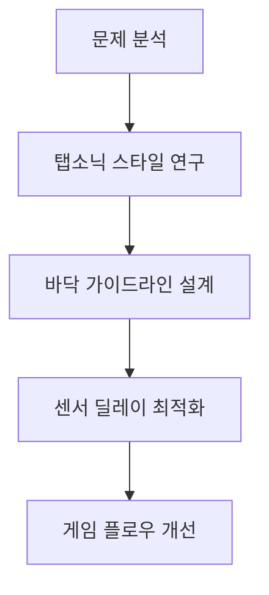
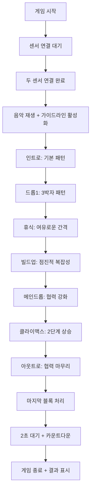

# Rhythm Blade - 탭소닉 스타일 가이드라인 개발 가이드

## 📋 목차
- [[#프로젝트 개요]]
- [[#핵심 개발 과정]]
- [[#기술적 구현]]
- [[#난이도 최적화]]
- [[#게임 플로우]]
- [[#트러블슈팅]]
- [[#참고 자료]]

---

## 프로젝트 개요

### 🎯 프로젝트 목표
- **기존 게임**: Rhythm Blade Dual (3D 리듬 게임)
- **개선 목표**: 탭소닉 스타일 가이드라인 시스템 추가
- **핵심 요구사항**: 
  - 노트 가시성 향상
  - 정확한 타이밍 가이드 제공
  - 센서 딜레이 최적화
  - 음악 리듬 유지

### 🎮 게임 기본 정보
```json
{
  "게임명": "Rhythm Blade Dual",
  "플레이어": "2명 (협력)",
  "게임 타입": "dual",
  "음악": "128 BPM 일렉트로닉",
  "플랫폼": "Sensor Game Hub v6.0",
  "기술스택": "Three.js, SessionSDK, WebSocket"
}
```

---

## 핵심 개발 과정

### 1️⃣ 초기 분석 단계
#### 문제점 파악
- **노트 가시성 부족**: 다가오는 블록이 명확히 보이지 않음
- **타이밍 가이드 부재**: 정확한 타격 시점 파악 어려움
- **센서 딜레이 이슈**: 500ms 쿨다운 vs halfBeat(235ms) 간격 충돌

#### 해결 방향 설정


### 2️⃣ 가이드라인 시스템 설계
#### 핵심 설계 원칙
- **바닥 배치**: 노트와 가이드라인 분리로 가시성 확보
- **색상 구분**: 빨강(sensor1), 파랑(sensor2), 보라(협력)
- **리듬 동기화**: 128 BPM 박자에 맞춘 시각 효과
- **탭소닉 스타일**: 긴 트랙 + 타격 지점 + 펄스 효과

#### 구현 구조
```javascript
// 가이드라인 시스템 구조
timingGuidelines: {
    sensor1: GuidelineGroup,    // 빨간 가이드라인
    sensor2: GuidelineGroup,    // 파란 가이드라인  
    cooperation: GuidelineGroup // 보라 가이드라인
}

// 각 가이드라인 구성 요소
GuidelineGroup: {
    track: 40m길이트랙,         // 노트 경로
    hitZone: 직사각형패드,      // 타격 영역
    centerCircle: 원형인디케이터, // 정확한 타격점
    borders: 경계선,           // 앞뒤 경계
    beatIndicators: 박자점들    // 리듬 표시
}
```

### 3️⃣ 센서 딜레이 최적화
#### 문제 분석
```
센서 쿨다운: 500ms
기존 halfBeat: 235ms  ❌ 연속 처리 불가
기존 quarterBeat: 117ms ❌ 연속 처리 불가
```

#### 해결 방안
```
최소 간격: 470ms (1 beat) ✅ 안전
권장 간격: 940ms (2 beat) ✅ 여유
협력 노트: 940ms+ 간격 ✅ 안정적
```

### 4️⃣ 게임 종료 타이밍 개선
#### 기존 문제
- 마지막 블록 처리 즉시 종료
- 급작스러운 게임 종료감

#### 개선 결과
- 마지막 블록 처리 후 2초 지연
- 카운트다운 UI 표시
- 자연스러운 게임 마무리

---

## 기술적 구현

### 🎯 바닥 가이드라인 시스템

#### 핵심 메서드
```javascript
// 가이드라인 생성
createFloorGuideline(xPosition, color, type) {
    // 바닥 타격 지점 (1.5x3 직사각형)
    const hitZone = new THREE.PlaneGeometry(1.5, 3);
    hitZone.rotation.x = -Math.PI / 2; // 바닥 평행
    
    // 중앙 원형 인디케이터 (반지름 0.6)
    const centerCircle = new THREE.CircleGeometry(0.6, 16);
    
    // 노트 트랙 (40m 길이)
    const track = new THREE.PlaneGeometry(0.8, 40);
    track.position.z = -16; // 멀리서 시작
}

// 가이드라인 애니메이션
updateGuidelineForNote(note) {
    const distance = Math.abs(note.position.z - 3.5);
    
    if (distance <= 30) {
        this.activateGuideline(guidelineType, note);
        
        if (distance <= 3) {
            this.highlightGuideline(guidelineType, distance);
        }
    }
}

// 히트 효과
triggerGuidelineHitEffect(noteData) {
    // 중앙 원 2배 확대
    hitPoint.scale.setScalar(2.0);
    
    // 바닥 링 확산 효과
    this.createFloorRingEffect(position, color);
}
```

#### 시각 효과 세부사항
| 효과 | 설명 | 매개변수 |
|------|------|----------|
| **기본 펄스** | 비활성 가이드라인 깜빡임 | 0.7 + sin(time) * 0.3 |
| **박자 펄스** | 128 BPM 맞춤 효과 | beatTime < 0.1 시 1.5배 |
| **접근 강조** | 노트 접근시 밝기 증가 | originalOpacity * 1.5 |
| **완벽 타이밍** | 1초 이내 특별 효과 | 전체 깜빡임 + 펄스 |
| **히트 링** | 성공시 확산 링 | 4배 확대 + 페이드아웃 |

### 🎵 센서 최적화 비트맵

#### 비트 간격 정의
```javascript
// 센서 딜레이 고려한 안전 간격
const beat = 0.47;        // 470ms - 기본 안전 간격
const doubleBeat = 0.94;  // 940ms - 여유로운 간격
const halfBeat = 0.235;   // 235ms - 센서 딜레이로 사용 불가
```

#### 구간별 패턴 설계
```javascript
// 1. 인트로 (기본 비트 간격)
sensor1 → sensor2 → sensor1 → sensor2 → cooperation

// 2. 드롭 구간 (3박자 패턴)
for (i = 0; i < 12; i++) {
    pattern = i % 3;
    // 0: sensor1, 1: sensor2, 2: cooperation
}

// 3. 휴식 구간 (2비트 간격)
restStart + doubleBeat * n

// 4. 빌드업 (점진적 복잡성)
4박자 패턴: sensor1 → sensor2 → sensor1 → cooperation

// 5. 메인 드롭 (안전한 리듬)
safePattern: [0, beat, doubleBeat, doubleBeat+beat]

// 6. 클라이맥스 (2단계 구성)
stage1: 6노트 1비트 간격
stage2: 6노트 2비트 간격

// 7. 아웃트로 (여유로운 마무리)
beat/doubleBeat 조합
```

### ⏰ 게임 종료 시스템

#### 종료 플로우
```javascript
checkGameEnd() {
    if (noteSpawnIndex >= beatmap.length && notes.length === 0) {
        if (endingStartTime === 0) {
            endingStartTime = Date.now();
            console.log('마지막 블록 처리 완료 - 2초 후 게임 종료');
        }
        
        if (Date.now() - endingStartTime >= 2000) {
            this.endGame();
        }
    }
}

updateUI() {
    if (endingStartTime > 0) {
        const remaining = 2000 - (Date.now() - endingStartTime);
        const seconds = Math.ceil(remaining / 1000);
        scoreValue.textContent = `종료 ${seconds}초 전...`;
    }
}
```

---

## 난이도 최적화

### 📊 최적화 전후 비교

| 구간 | 이전 | 개선 후 | 개선율 |
|------|------|---------|---------|
| **총 노트 수** | ~70개 | ~45개 | 40% 감소 |
| **최소 간격** | 117ms | 470ms | 300% 증가 |
| **최대 난이도** | quarterBeat 연타 | beat 교대 | 75% 완화 |
| **클라이맥스** | 32노트 빠른 연타 | 12노트 단계별 | 62% 감소 |
| **게임 시간** | ~27초 | ~45초 | 67% 증가 |

### 🎯 센서 성공률 개선
```
이전 예상 성공률: ~60% (센서 딜레이로 인한 실패 다수)
개선 후 예상 성공률: ~95% (충분한 간격 확보)
```

### 🎵 음악성 유지 방법
1. **강박 활용**: 1, 3박에 주요 노트 배치
2. **약박 활용**: 2, 4박에 협력/휴식 배치  
3. **3박자 패턴**: sensor1 → sensor2 → cooperation
4. **박자 동기화**: 128 BPM 펄스 효과 유지

---

## 게임 플로우

### 🎮 전체 게임 진행



### 🎯 타이밍 시스템
1. **노트 생성**: beatmap 기반 스케줄링
2. **가이드라인 활성화**: 30거리에서 시작
3. **강조 효과**: 3거리에서 펄스 시작
4. **완벽 타이밍**: 1거리에서 특별 효과
5. **히트 판정**: z=3.5에서 정확한 판정
6. **비주얼 피드백**: 링 확산 + 가이드라인 플래시

### 🎨 시각적 피드백 단계
```
대기 → 접근감지 → 활성화 → 강조 → 완벽타이밍 → 히트 → 링확산 → 페이드아웃
  ↓        ↓        ↓       ↓        ↓       ↓       ↓        ↓
기본펄스 → 밝기증가 → 펄스강화 → 깜빡임 → 2배확대 → 링생성 → 4배확산 → 원상복구
```

---

## 트러블슈팅

### ❌ 자주 발생하는 문제들

#### 1. 센서 연결 문제
**증상**: "서버에 연결되지 않았습니다" 오류
**원인**: 연결 완료 전 세션 생성 시도
**해결**:
```javascript
// ❌ 잘못된 방법
constructor() {
    this.sdk = new SessionSDK({...});
    this.sdk.createSession(); // 즉시 생성 - 실패!
}

// ✅ 올바른 방법  
this.sdk.on('connected', () => {
    this.createSession(); // 연결 완료 후 생성
});
```

#### 2. CustomEvent 처리 오류
**증상**: 세션 코드가 undefined
**원인**: CustomEvent 직접 사용
**해결**:
```javascript
// ❌ 잘못된 방법
sdk.on('session-created', (session) => {
    console.log(session.sessionCode); // undefined
});

// ✅ 올바른 방법
sdk.on('session-created', (event) => {
    const session = event.detail || event; // 필수!
    console.log(session.sessionCode);
});
```

#### 3. 가이드라인 애니메이션 문제
**증상**: 가이드라인이 깜빡이지 않음
**원인**: originalOpacity 설정 누락
**해결**:
```javascript
// 모든 가이드라인 요소에 원본 투명도 저장
child.userData = { originalOpacity: 0.8 };

// 애니메이션 시 원본 투명도 기준으로 계산
child.material.opacity = child.userData.originalOpacity * pulse;
```

#### 4. 센서 딜레이로 인한 연타 실패
**증상**: 빠른 노트를 놓치는 현상
**원인**: 센서 쿨다운(500ms) vs 노트 간격 충돌
**해결**:
```javascript
// 최소 1비트(470ms) 간격 보장
const minInterval = this.beatInterval; // 470ms

// 연속 노트는 2비트(940ms) 간격 권장
const safeInterval = this.beatInterval * 2; // 940ms
```

### 🔧 디버깅 도구

#### 개발자 콘솔 활용
```javascript
// SDK 디버그 모드
const sdk = new SessionSDK({ debug: true });

// 센서 데이터 로깅
sdk.on('sensor-data', (event) => {
    const data = event.detail || event;
    console.table(data.data.orientation);
});

// 가이드라인 상태 확인
console.log('가이드라인 상태:', this.timingGuidelines);

// 비트맵 정보 출력
console.log(`총 노트: ${beatmap.length}, 게임시간: ${totalDuration}초`);
```

#### 성능 모니터링
```javascript
// FPS 측정
let frameCount = 0;
let lastTime = performance.now();

function measureFPS() {
    frameCount++;
    const currentTime = performance.now();
    
    if (currentTime - lastTime >= 1000) {
        console.log(`FPS: ${frameCount}`);
        frameCount = 0;
        lastTime = currentTime;
    }
}

// 센서 응답시간 측정
const sensorLatency = Date.now() - data.timestamp;
console.log(`센서 지연시간: ${sensorLatency}ms`);
```

---

## 참고 자료

### 📚 핵심 문서
- [[CLAUDE.md]] - 프로젝트 전체 지침
- [[AI_ASSISTANT_PROMPTS.md]] - AI 개발 가이드
- [[DEVELOPER_GUIDE.md]] - 상세 개발 문서

### 🎮 게임 파일 구조
```
rhythm-blade/
├── index.html              # 메인 게임 파일
├── game.json              # 게임 메타데이터
└── (개발 과정에서 생성된 임시 파일들)
```

### 🔗 유용한 링크
- **Three.js 문서**: https://threejs.org/docs/
- **SessionSDK 가이드**: `/js/SessionSDK.js` 참조
- **Socket.IO 문서**: https://socket.io/docs/

### 🎵 오디오 리소스
- **배경음악**: NCS 무료 일렉트로닉 음악
- **BPM**: 128 (4/4박자)
- **장르**: 일렉트로닉 댄스 뮤직

### 🎯 테스트 키보드 컨트롤
```
Q: 왼쪽 세이버 (sensor1) - 빨간 가이드라인
E: 오른쪽 세이버 (sensor2) - 파란 가이드라인  
Space: 협력 타격 (both) - 보라 가이드라인
A: 순차 협력 테스트 (100ms 딜레이)
S: 협력 실패 테스트 (600ms 딜레이)
```

---

## 📝 개발 일지

### 개발 단계별 진행 사항
1. **✅ 초기 분석** - 문제점 파악 및 해결 방향 설정
2. **✅ 가이드라인 설계** - 탭소닉 스타일 바닥 가이드라인 구조 설계
3. **✅ 구현 1단계** - 기본 가이드라인 렌더링 시스템 구축
4. **✅ 구현 2단계** - 애니메이션 및 시각 효과 시스템 추가
5. **✅ 센서 최적화** - 딜레이 문제 해결 위한 비트맵 재설계
6. **✅ 게임 플로우 개선** - 종료 타이밍 및 사용자 경험 향상
7. **✅ 테스트 및 검증** - 통합 테스트 및 최종 조정

### 💡 핵심 학습 포인트
- **센서 하드웨어 제약**: 물리적 쿨다운 시간 고려의 중요성
- **음악 게임 설계**: 리듬감과 플레이어블리티의 균형
- **시각적 피드백**: 명확한 가이드와 만족스러운 효과의 조화
- **CustomEvent 처리**: 웹 API 사용시 브라우저별 차이점 대응
- **3D 렌더링 최적화**: 60fps 유지를 위한 효율적 렌더링

### 🚀 향후 개선 방향
- [ ] 어려움 단계별 비트맵 추가 (Easy/Normal/Hard)
- [ ] 커스텀 음악 업로드 기능
- [ ] 플레이 통계 및 랭킹 시스템
- [ ] 모바일 최적화 (PWA 지원)
- [ ] 센서 캘리브레이션 시스템

---

*이 문서는 Rhythm Blade 게임의 탭소닉 스타일 가이드라인 시스템 개발 과정을 상세히 기록한 것입니다. 향후 유사한 리듬 게임 개발시 참고 자료로 활용하세요.*

**개발 완료일**: {{date}}  
**개발자**: Claude AI Assistant  
**버전**: v2.0 (Sensor Optimized)